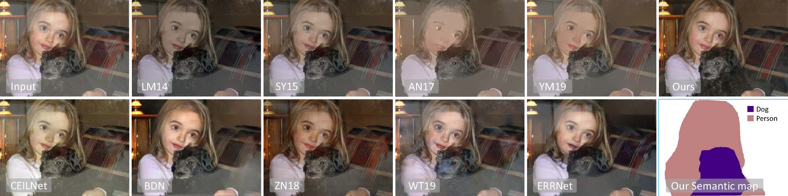

## SGR2N &mdash; Semantic Guided Reflection Removal Network

**Picture:** *Previous low-level priors based methods and deep learning based methods all fail to remove reflections on the person. With the semantic information and enforcing different parts of the human belong to the same layer, the reflection is removed properly..*

This repository contains the official PyTorch implementation of the following paper:

> **Semantic Guided Single Image Reflection Removal** 
> Yunfei Liu, Yu Li, Shaodi You, and Feng Lu 
> https://arxiv.org/abs/1907.11912
>
> **Abstract:** *Reflection is common in images capturing scenes behind a glass window, which is not only a disturbance visually but also influence the performance of other computer vision algorithms. Single image reflection removal is an ill-posed problem because the color at each pixel needs to be separated into two values, i.e., the desired clear background and the reflection. To solve it, existing methods propose priors such as smoothness, color consistency. However, the low-level priors are not reliable in complex scenes, for instance, when capturing a real outdoor scene through a window, both the foreground and background contain both smooth and sharp area and a variety of color. In this paper, inspired by the fact that human can separate the two layers easily by recognizing the objects, we use the object semantic as guidance to force the same semantic object belong to the same layer. Extensive experiments on different datasets show that adding the semantic information offers a significant improvement to reflection separation. We also demonstrate the applications of the proposed method to other computer vision tasks.*

## Resources

Material related to our paper is available via the following links:

- Paper: https://arxiv.org/abs/1907.11912
- Project: Comming soon!
- Code: https://github.com/DreamtaleCore/SGRRN
- Semantic reflection removal dataset: Comming soon!

## System requirements

* Only Linux is tested, Windows is under test.
* 64-bit Python 3.6 installation. 
* Pytorch 1.2.0 or newer with GPU support.
* One or more high-end NVIDIA GPUs with at least 8GB of DRAM.
* NVIDIA driver 391.35 or newer, CUDA toolkit 9.0 or newer, cuDNN 7.3.1 or newer.

## Using pre-trained networks and training

Comming soon!